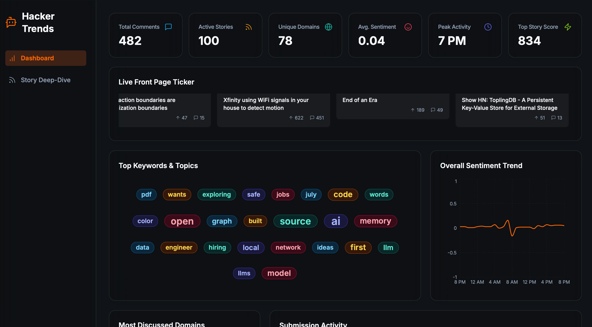

<div align="center">

# 🔥 Hacker Trends

**Real-time analytics and sentiment analysis for Hacker News**

[](https://www.gnu.org/licenses/agpl-3.0)
[](https://hacker-trends.vercel.app/)
[](https://reactjs.org/)
[](https://supabase.com/)

*Transform Hacker News data into actionable insights with beautiful visualizations and real-time sentiment analysis*

[🎯 **Live Demo**](https://hacker-trends.vercel.app/) • [📖 **Documentation**](#-getting-started) • [🐛 **Report Bug**](https://github.com/rawveg/hacker-trends/issues) • [✨ **Request Feature**](https://github.com/rawveg/hacker-trends/issues)

</div>



## ✨ Features

### 📊 **Real-time Analytics Dashboard**
- **Live Data Visualization** - Interactive charts and graphs updated in real-time
- **Comprehensive Metrics** - Track stories, comments, domains, and user activity
- **Responsive Design** - Perfect experience on desktop, tablet, and mobile

### 🎯 **Advanced Sentiment Analysis**
- **AI-Powered Insights** - Analyze comment sentiment across all stories
- **Trend Tracking** - Monitor sentiment changes over time
- **Domain-Based Analysis** - See how different sources perform

### 🔍 **Deep-Dive Exploration**
- **Interactive Story Explorer** - Click any data point to dive deeper
- **Keyword Analysis** - Explore trending topics and keywords
- **Comment Threading** - Full comment trees with sentiment scores
- **Activity Heatmaps** - Visualize submission patterns

### 🎨 **Beautiful User Experience**
- **Live Ticker** - Scrolling feed of current front-page stories
- **Dark/Light Themes** - Seamless theme switching
- **Customizable Settings** - Adjust ticker speed and preferences
- **Smooth Animations** - Polished interactions throughout

---

## 🛠️ Tech Stack

<div align="center">

| Frontend | Backend | Data & Analytics | Deployment |
|----------|---------|------------------|------------|
|  |  |  |  |
|  |  |  |  |
|  |  |  | |
|  | | | |

</div>

---

## 🚀 Getting Started

### 📋 Prerequisites

Before you begin, ensure you have the following installed:
- **Node.js** (v18 or higher)
- **npm** or **yarn**
- **Git**

### 🔧 Installation

#### 1️⃣ **Clone the Repository**
```bash
git clone https://github.com/rawveg/hacker-trends.git
cd hacker-trends
```

#### 2️⃣ **Install Dependencies**
```bash
npm install
# or
yarn install
```

#### 3️⃣ **Set Up Supabase Backend**

<details>
<summary><strong>📖 Detailed Supabase Setup Instructions</strong></summary>

1. **Create a Supabase Project**
   - Visit [supabase.com](https://supabase.com)
   - Click "New Project"
   - Fill in your project details

2. **Deploy Edge Functions**
   
   For each function in the `supabase/functions` directory:
   
   - **get-top-stories**: Fetches the top 100 stories from Hacker News
   - **get-comment-sentiments**: Analyzes sentiment of comments
   - **get-story-with-comments**: Retrieves full story details with threaded comments
   
   In your Supabase dashboard:
   - Go to "Edge Functions"
   - Create a new function for each one
   - Copy the code from the corresponding file
   - Deploy the function

3. **Get Your Credentials**
   - Navigate to `Project Settings` → `API`
   - Copy your **Project URL** and **anon public key**

</details>

#### 4️⃣ **Configure Environment Variables**

Create a `.env` file in the root directory:

```bash
# Copy from .env.example
cp .env.example .env
```

Edit `.env` with your Supabase credentials:
```env
VITE_SUPABASE_URL="your_supabase_project_url"
VITE_SUPABASE_ANON_KEY="your_supabase_anon_key"
```

#### 5️⃣ **Start Development Server**
```bash
npm run dev
# or
yarn dev
```

🎉 **Success!** Open [http://localhost:8080](http://localhost:8080) to see your application.

---

## 🌐 Deployment

### Deploy to Vercel (Recommended)

1. **Push to GitHub**
   ```bash
   git add .
   git commit -m "Initial commit"
   git push origin main
   ```

2. **Deploy on Vercel**
   - Visit [vercel.com](https://vercel.com)
   - Click "Add New..." → "Project"
   - Import your GitHub repository

3. **Configure Environment Variables**
   - In your Vercel project settings
   - Go to "Environment Variables"
   - Add `VITE_SUPABASE_URL` and `VITE_SUPABASE_ANON_KEY`

4. **Deploy**
   - Vercel will automatically build and deploy
   - Your app will be live at `your-project.vercel.app`

---

## 📱 Features Deep Dive

### 🎯 **Dashboard Widgets**

| Widget | Description | Interactions |
|--------|-------------|--------------|
| **Live Ticker** | Real-time scrolling feed of front-page stories | Hover to pause, click to visit |
| **Keyword Cloud** | Most mentioned words and topics | Click keywords for deep-dive analysis |
| **Sentiment Trend** | 24-hour sentiment analysis timeline | Click points for detailed breakdown |
| **Activity Heatmap** | Submission patterns by day/hour | Click cells to explore time periods |
| **Score vs Comments** | Story performance visualization | Click stories to read full content |
| **Domain Analysis** | Most discussed websites and sources | Click domains for filtered views |

### 🔍 **Deep-Dive Pages**

- **Story Explorer**: Full story content with threaded comments and sentiment scores
- **Keyword Analysis**: All stories mentioning specific terms or from specific domains
- **Sentiment Breakdown**: Comments categorized by positive, neutral, or negative sentiment
- **Activity Analysis**: Stories submitted during specific time periods

### ⚙️ **Customization Options**

- **Theme Selection**: Light, dark, or system preference
- **Ticker Speed**: Adjustable animation speed for the live ticker
- **Data Refresh**: Configurable update intervals

---

## 🤝 Contributing

We welcome contributions! Here's how you can help:

### 🐛 **Report Bugs**
- Use the [issue tracker](https://github.com/rawveg/hacker-trends/issues)
- Include detailed reproduction steps
- Provide browser and OS information

### ✨ **Suggest Features**
- Open a [feature request](https://github.com/rawveg/hacker-trends/issues)
- Describe the use case and expected behavior
- Include mockups or examples if possible

### 💻 **Submit Code**
1. Fork the repository
2. Create a feature branch (`git checkout -b feature/amazing-feature`)
3. Commit your changes (`git commit -m 'Add amazing feature'`)
4. Push to the branch (`git push origin feature/amazing-feature`)
5. Open a Pull Request

---

## 📄 License

This project is licensed under the **GNU Affero General Public License v3.0**.

**What this means:**
- ✅ You can use, modify, and distribute this software
- ✅ You can use it for commercial purposes
- ⚠️ You must disclose the source code of any modifications
- ⚠️ Network use is considered distribution (AGPL requirement)

See the [LICENSE](LICENSE) file for full details.

---

## 🙏 Acknowledgments

- **Hacker News** - For providing the excellent API that powers this application
- **Supabase** - For the robust backend infrastructure and edge functions
- **Vercel** - For seamless deployment and hosting
- **The Open Source Community** - For the amazing tools and libraries that make this possible

---

<div align="center">

**⭐ Star this repository if you find it useful!**

Made with ❤️  for all lovers of Hacker News

[🔝 Back to Top](#-hacker-trends)

</div>
